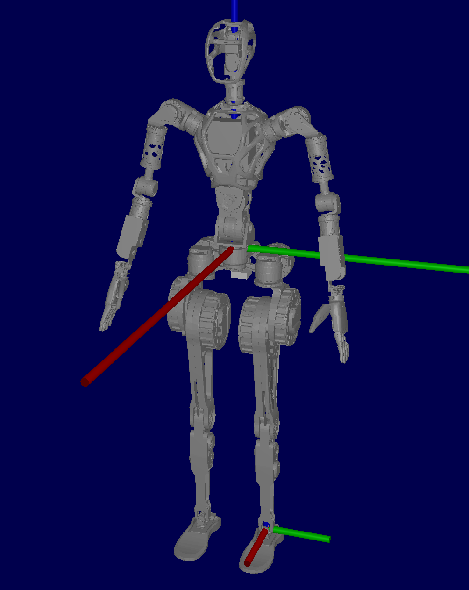
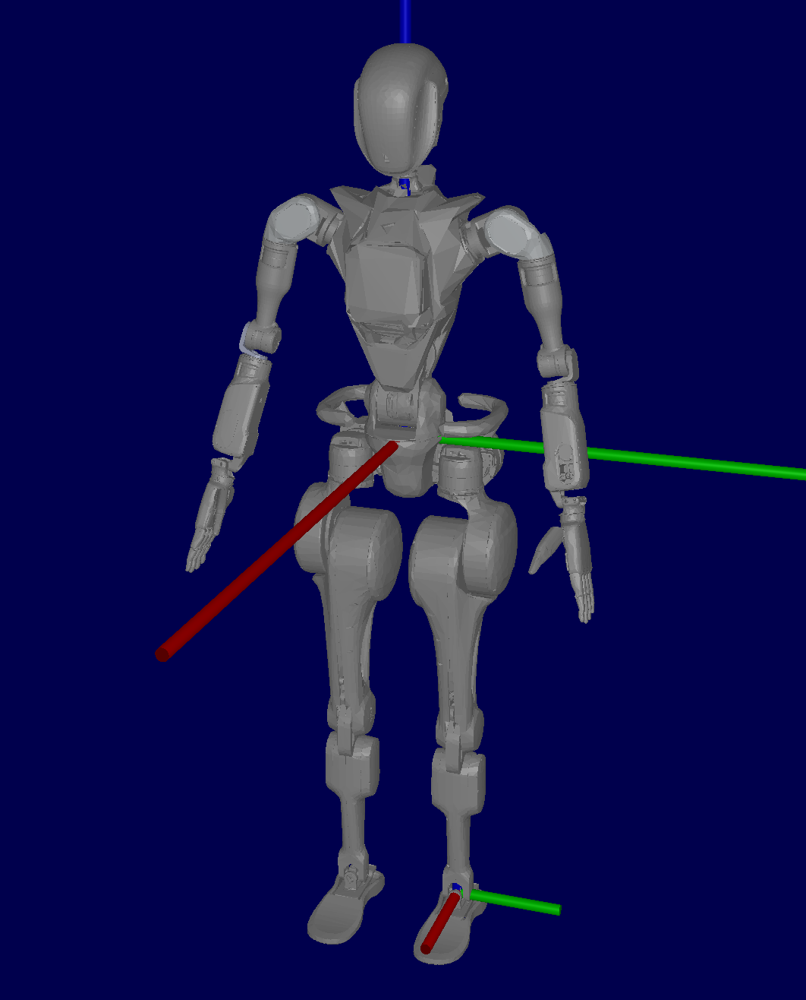

# Wiki-GRx-Models




[//]: # (![]&#40;./pictures/GR1T1.png&#41;)

Welcome to the GRx Robot Model Repository!
This repository provides the Unified Robot Description Format (URDF) files for the GRx robot,
enabling enthusiasts and developers to explore, modify, and extend the capabilities of this robotic platform.

## Overview

The Fourier Intelligence GRx series robot is a versatile and robust platform designed for a wide range of applications,
including research, education, and industrial automation. This repository contains the necessary URDF files
and associated resources to simulate and develop with the GRx robot using popular robotics software tools.

## Features

- **URDF Files**: Complete set of URDF files describing the GRx robots' kinematic and dynamic properties.
- **Visual Models**: High-quality 3D models for visualization in simulation environments.
- **Collision Models**: Optimized collision models for efficient simulation.
- **Issac Gym**: Support for NVIDIA Isaac Gym for reinforcement learning and robotics research.
- **Isaac Sim**: Support for NVIDIA Isaac Sim for high-fidelity simulation.


## Name table of robot for clarify
> *Notice: There are two types of dexterous hand, fourier hand and inspire hand. Select the correct `urdf` with the hand you have.*

| Product Name |  Code Name |
| :----------: | :--------: |
|   GR-1       |  GR1T1 with dexterous hand |
|   GR-1L      |  GR1T1 with fourier jaw |
|   GR-1 Pro   |  GR1T2 with dexterous hand |
|   GR-1L Pro  |  GR1T2 with fourier jaw |


## Model List
- GR1T1
    - GR1T1_nohand: The `urdf` for GR1T1 without hand.
    - GR1T1_jaw: The `urdf` for GR1T1 with foueire jaw.
    - GR1T1_fourier_hand: The `urdf` for GR1T1 with fourier hand.
    - GR1T1_inspire_hand: The `urdf` for GR1T1 with inspire hand.
- GR1T2:
    - GR1T2_nohand: The `urdf` for GR1T2 without hand.
    - GR1T2_jaw: The `urdf` for GR1T2 with fourier jaw.
    - GR1T2_fourier_hand: The `urdf` for GR1T2 with fourier hand.
    - GR1T2_inspire_hand: The `urdf` for GR1T2 with inspire hand.


## Model Verification

To verify the model, you can use the `urdf-viz` tool to visualize the robot in 3D.

- https://github.com/openrr/urdf-viz

### Install with Cargo

```bash
sudo apt-get install cmake xorg-dev libglu1-mesa-dev
sudo apt install cargo
cargo install urdf-viz
```

### Display the Model

```bash
# Display the GR1T1 model with fourier hand
cd ./GRX/GR1/GR1T1/URDF/urdf
urdf-viz GR1T1_fourier_hand.urdf

# Display the GR1T2 model with fourier hand
cd ./GRX/GR1/GR1T2/URDF/urdf
urdf-viz GR1T2_fourier_hand.urdf
```


## MJCF Conversion

If you are interested in converting the URDF files to MuJoCo MJCF format, you can refer to the following repository:

- [Wiki-MJCF in Github](https://github.com/FFTAI/wiki-mjcf/)
- [Wiki-MJCF in Gitee](https://gitee.com/FourierIntelligence/wiki-mjcf/)

---

Thank you for your interest in the Fourier Intelligence GRx Robot Repositories.
We hope you find this resource helpful in your robotics projects!
