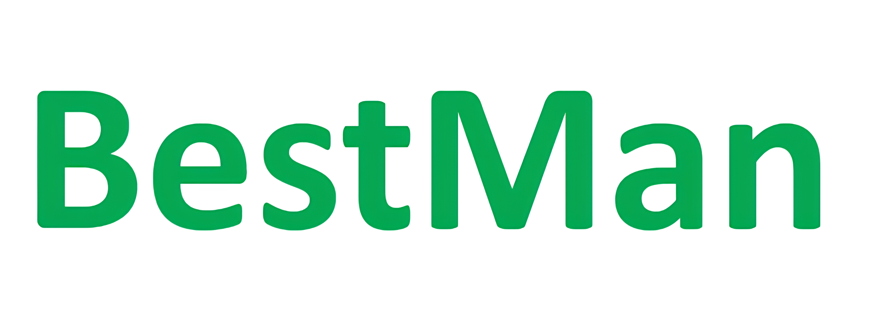

<!-- # BestMan - A Pybullet-based Mobile Manipulator Simulator -->

[](https://github.com/facebookresearch/home-robot/blob/main/LICENSE)
[](https://releases.ubuntu.com/22.04/)
[](https://www.python.org/downloads/release/python-370/)
[](https://github.com/pre-commit/pre-commit)
[](https://github.com/psf/black)
[](https://timothycrosley.github.io/isort/)

Welcome to the official repository of BestMan, a mobile manipulator simulator (with a wheel-base and arm) built on PyBullet.


## 💻 Installation

- Pull the repository and update the submodule

```
git clone https://github.com/AutonoBot-Lab/BestMan_Pybullet.git
cd BestMan_Pybullet
git submodule init
git submodule update
```

### :shamrock: Conda

First install `Anaconda` or `minconda` on linux system and then perform the following steps：

- Run the following script to add the project to the PYTHON search path
```
cd Install
chmod 777 pythonpath.sh
bash pythonpath.sh
source ~/.bashrc
```

- Configure related libraries and links to support OpenGL rendering (If it already exists, skip this step.)
```
sudo apt update && sudo apt install -y libgl1-mesa-glx libglib2.0-0
sudo mkdir /usr/lib/dri
sudo ln -s /lib/x86_64-linux-gnu/dri/swrast_dri.so /usr/lib/dri/swrast_dri.so
```

- Install gcc/g++ 9 (If it already exists, skip this step.)
```
sudo apt install -y build-essential gcc-9 g++-9
sudo update-alternatives --install /usr/bin/gcc gcc /usr/bin/gcc-9 9
sudo update-alternatives --install /usr/bin/g++ g++ /usr/bin/g++-9 9
sudo update-alternatives --config gcc  # choice gcc-9
sudo update-alternatives --config g++  # choice g++-9

# Make sure gcc and g++ versions are consistent (conda enviroment don't install gcc to prevent problems caused by inconsistent versions)
gcc -v
g++ -v
```

- Configure mamba to speed up the conda environment construction (Optional, skip if installation is slow or fails)
```
conda install mamba -n base -c conda-forge
```

- Create basic conda environment
```
conda(mamba) env create -f basic_environment.yaml
conda(mamba) activate BestMan

# Install torch
conda(mamba) env update -f cuda116.yaml

# Install lang-segment-anything
pip install -U git+https://github.com/luca-medeiros/lang-segment-anything.git

# Install MinkowskiEngine
pip install -U git+https://github.com/NVIDIA/MinkowskiEngine -v --no-deps --global-option="--blas_include_dirs=${CONDA_PREFIX}/include" --global-option="--blas=openblas"

# Install graspnetAPI
pip install graspnetAPI

# Install pointnet2
cd third_party/pointnet2
python setup.py install
```

- AnyGrasp License 
  
  You need to get anygrasp [license and checkpoint](./Perception/Grasp_Pose_Estimation/AnyGrasp/README.md) to use it.
<br/>


### :shamrock: Docker

##### Windows

- Pull docker image from tencentyun

```
docker pull ccr.ccs.tencentyun.com/4090/bestman:v1
```

- Create docker container

```
docker run -it --gpus all --name BestMan ccr.ccs.tencentyun.com/4090/bestman:v1
```

- Install [VcXsrv Windows X Server](https://sourceforge.net/projects/vcxsrv/), Start and keep running in the background.

- Execute `echo $DISPLAY` inside the container, Make sure the result is `host.docker.internal:0` so that it can be visualized on the host machine, if not:

```
export DISPLAY=host.docker.internal:0
```


##### Linux
- TBD
<br/>


## 🔎 Project Structure & API References

- [Project Structure](docs/project_structure.txt)
- [API References](https://bestman-pybullet.readthedocs.io)
<br/>


## 👨‍💻 Basic Demos

&emsp;&emsp;We have supplemented and improved the [pybullet-blender-recorder](https://github.com/huy-ha/pybullet-blender-recorder) code base, importing the images in the pybullet scene into blender for rendering, which improves the rendering effect. For simple scenes and tasks, the import can be completed within 2 minutes, and for complex scenes and tasks, the import can be completed within half an hour.

<br/>
First, Enter directory Examples:

```
cd Examples
```

Below are some examples and their rendering in Blender


:shamrock: **Navigation**

```
python navigation_basic.py
```

<video src="https://github.com/user-attachments/assets/63fe074e-ba27-4de8-8095-99289552b17a"></video>

<video src="https://github.com/user-attachments/assets/4e87e324-6621-4e47-810d-31c51582fb05"></video>

<br/>


:shamrock: **Manipulation**

- Open Fridge

```
python open_fridge.py
```

<video src="https://github.com/user-attachments/assets/9aab5ca2-fb09-4b9f-a989-54ef5c1d2884"></video>

<video src="https://github.com/user-attachments/assets/16d8c3b6-d5a7-44b9-bd8a-c2182de20e52"></video>

<br/>


- Open microwave

```
python open_microwave.py
```


<video src="https://github.com/user-attachments/assets/d0d97b08-423b-4af5-a418-f36872541f99"></video>

<video src="https://github.com/user-attachments/assets/fb8ef3ea-d045-4bbf-a28f-0bec56930aae"></video>


<br/>


- Grasp bowl on table use sucker

```
python grasp_bowl_on_table_sucker.py
```


<video src="https://github.com/user-attachments/assets/0eb05120-8016-425b-a46a-b711e5290691"></video>

<video src="https://github.com/user-attachments/assets/9d67e5d1-a4bc-47a3-b03b-21641a365037"></video>


<br/>


- Grasp lego on table use gripper

```
python grasp_lego_on_table_gripper.py
```


<video src="https://github.com/user-attachments/assets/3bf15b13-3113-4a72-950c-7e9c1367ed9e"></video>

<video src="https://github.com/user-attachments/assets/0ef18785-26b9-4855-b19d-87e25014421f"></video>


<br/>


- Move bowl from drawer to table

```
python move_bowl_from_drawer_to_table.py
```


<video src="https://github.com/user-attachments/assets/db4c7ec3-c136-4c6a-8323-2bef6bc09c84"></video>

<video src="https://github.com/user-attachments/assets/0a82fd20-c533-4881-8672-2f15b83b2166"></video>

<br/>


##  :handshake: Reference

If you find this work useful, please consider citing:

```
@inproceedings{ding2023task,
  title={Task and motion planning with large language models for object rearrangement},
  author={Ding, Yan and Zhang, Xiaohan and Paxton, Chris and Zhang, Shiqi},
  booktitle={2023 IEEE/RSJ International Conference on Intelligent Robots and Systems (IROS)},
  pages={2086--2092},
  year={2023},
  organization={IEEE}
}

@article{ding2023integrating,
  title={Integrating action knowledge and LLMs for task planning and situation handling in open worlds},
  author={Ding, Yan and Zhang, Xiaohan and Amiri, Saeid and Cao, Nieqing and Yang, Hao and Kaminski, Andy and Esselink, Chad and Zhang, Shiqi},
  journal={Autonomous Robots},
  volume={47},
  number={8},
  pages={981--997},
  year={2023},
  publisher={Springer}
}
```
