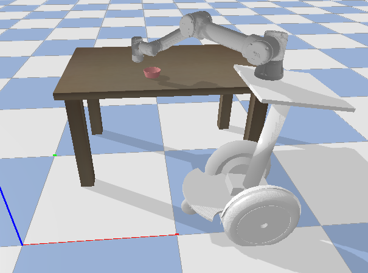
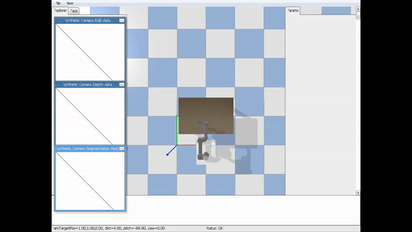
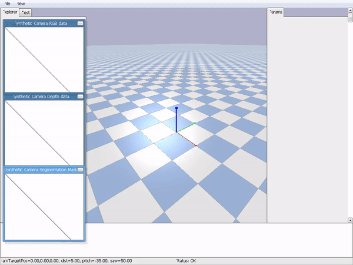
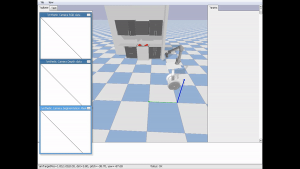

## The code is a Pybullet simulator database for BestMan robot. The BestMan robot consists of a base (Segbot) and an arm (Ur5e).

Step 0: Download the repo

`git clone https://github.com/yding25/BestMan_Pybullet.git`

Step 1: Download the object models

`cd BestMan_Pybullet`

`git submodule update --init --recursive`

Step 2: Configure a proper environment in Python 3

`pip install -e .`

Step 3: Run a demo (navigation)

`python ./examples/example_navigation.py`

Step 4: Run a demo (manipulation)

`python ./examples/example_manipulation.py`

Step 5: Run a demo (kitchen)

`python ./examples/example_kitchen.py`

Note that "functions_in_utils_control.txt" lists common functions in "utils_control.py".

