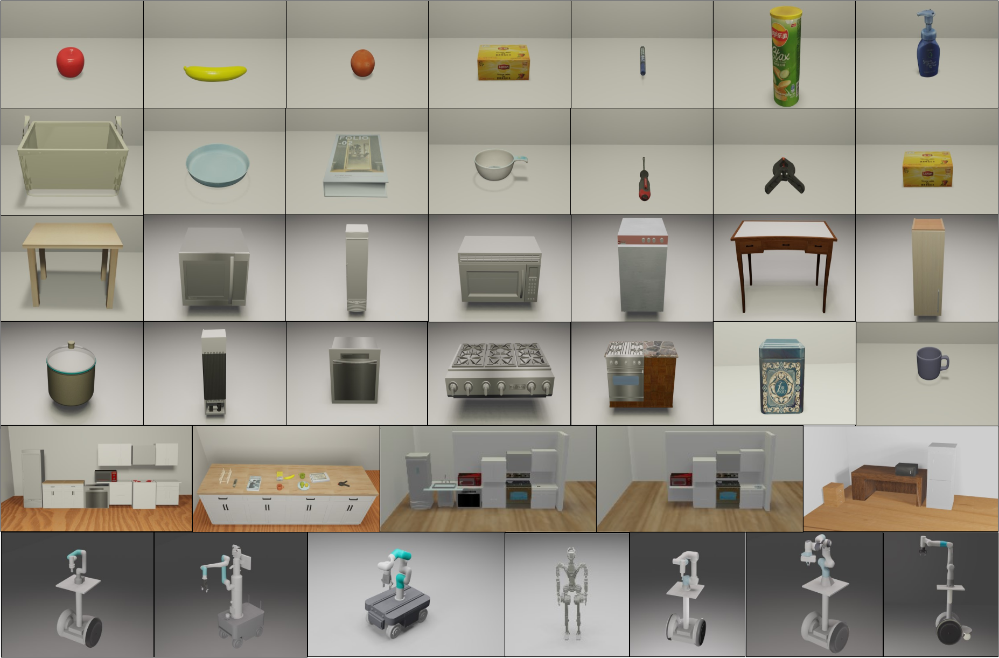

<br>
<p align="center">
<h1 align="center"><strong>BestMan: A Modular Mobile Manipulator Platform for Embodied AI with Unified Simulation-Hardware APIs</strong></h1>
  <p align="center">
    Chongqing University&emsp;&emsp;&emsp;&emsp;Shanghai AI Laboratory&emsp;&emsp;&emsp;&emsp;Xi'an Jiaotong-Liverpool University
  </p>
</p>

<div id="top" align="center">


<!-- # BestMan - A Pybullet-based Mobile Manipulator Simulator -->

[](https://github.com/facebookresearch/home-robot/blob/main/LICENSE)
[](https://releases.ubuntu.com/22.04/)
[](https://www.python.org/downloads/release/python-370/)
[](https://github.com/pre-commit/pre-commit)
[](https://github.com/psf/black)
[](https://timothycrosley.github.io/isort/)
[](https://bestman-pybullet.readthedocs.io)



Welcome to the official repository of BestMan!

A mobile manipulator (with a wheel-base and arm) platform built on PyBullet simulation with unified hardware APIs.

</div>

## 📋 Contents

- [💻 Installation](#-Installation) <!-- omit in toc -->
- [👨‍💻 Basic Demos](#-Basic-Demos)
- [📝 TODO List](#-todo-list)
- [🤝 Reference](#-Reference)


## 💻 Installation

- Pull the repository and update the submodule

```
git clone https://github.com/AutonoBot-Lab/BestMan_Pybullet.git
cd BestMan_Pybullet
git submodule update --init
```

### :shamrock: Conda

First install `Anaconda` or `minconda` on linux system and then perform the following steps：

- Run the following script to add the project to the PYTHON search path
```
cd Install
chmod 777 pythonpath.sh
bash pythonpath.sh
source ~/.bashrc
```

- Install ffmpeg to enable video record
```
sudo apt update && sudo apt install ffmpeg
```

- Configure related libraries and links to support OpenGL rendering (If it already exists, skip this step.)
```
sudo apt update && sudo apt install -y libgl1-mesa-glx libglib2.0-0
sudo mkdir /usr/lib/dri
sudo ln -s /lib/x86_64-linux-gnu/dri/swrast_dri.so /usr/lib/dri/swrast_dri.so
```

- Install gcc/g++ 9 (If it already exists, skip this step.)
```
sudo apt install -y build-essential gcc-9 g++-9
sudo update-alternatives --install /usr/bin/gcc gcc /usr/bin/gcc-9 9
sudo update-alternatives --install /usr/bin/g++ g++ /usr/bin/g++-9 9
sudo update-alternatives --config gcc  # choice gcc-9
sudo update-alternatives --config g++  # choice g++-9

# Make sure gcc and g++ versions are consistent (conda enviroment don't install gcc to prevent problems caused by inconsistent versions)
gcc -v
g++ -v
```

- Configure mamba to speed up the conda environment construction (Optional, skip if installation is slow or fails)
```
conda install mamba -n base -c conda-forge
```

- Create basic conda environment
```
conda(mamba) env create -f basic_env.yaml
conda(mamba) activate BestMan
```

- Install torch
```
conda(mamba) env update -f cuda116.yaml
```

- Install lang-segment-anything
```
pip install -U git+https://github.com/luca-medeiros/lang-segment-anything.git
```

- Install AnyGrasp

&emsp;&emsp;**Note**:
  
> &emsp;You need to get anygrasp [license and checkpoint](./Perception/Grasp_Pose_Estimation/AnyGrasp/README.md) to use it.

> &emsp;You need `export MAX_JOBS=2` in terminal; before pip install if you are running on an laptop due to [this issue](https://github.com/NVIDIA/MinkowskiEngine/issues/228).
```
# Install MinkowskiEngine
conda install pytorch=1.13.1 -c pytorch --force-reinstall
pip install -U git+https://github.com/NVIDIA/MinkowskiEngine -v --no-deps --global-option="--blas_include_dirs=${CONDA_PREFIX}/include" --global-option="--blas=openblas"

# Install graspnetAPI
pip install graspnetAPI

# Install pointnet2
cd third_party/pointnet2
python setup.py install

# Force reinstall to ensure version
pip install --force-reinstall opencv-python==4.1.2.30 numpy==1.23.5
```


### :shamrock: Docker

##### Windows

- Pull docker image from tencentyun

```
docker pull ccr.ccs.tencentyun.com/4090/bestman:v1
```

- Create docker container

```
docker run -it --gpus all --name BestMan ccr.ccs.tencentyun.com/4090/bestman:v1
```

- Install [VcXsrv Windows X Server](https://sourceforge.net/projects/vcxsrv/), Start and keep running in the background.

- Execute `echo $DISPLAY` inside the container, Make sure the result is `host.docker.internal:0` so that it can be visualized on the host machine, if not:

```
export DISPLAY=host.docker.internal:0
```


##### Linux
- TBD
<br/>


## 👨‍💻 Basic Demos

### 🌏 Overview

https://github.com/user-attachments/assets/51d5ec4b-e8c6-408e-b3b4-0492801ee496

### 🚀 Run

Enter directory Examples:

```
cd Examples
```

### 🎇 Blender Render

`open microwave` demo with blender render:

<video src="https://github.com/user-attachments/assets/fb8ef3ea-d045-4bbf-a28f-0bec56930aae"></video>

<br/>

We have improved the [pybullet-blender-recorder](https://github.com/huy-ha/pybullet-blender-recorder) to import pybullet scene into blender for better rendering

If you want to enable **pybullet-blender-recorder**, please：

1. Set `blender: Ture` in Config/default.yaml

2. After running the demo, a pkl file will be generated and saved in **Examples/record** dir

3. Install the `pyBulletSimImporter.py` plugin under **Visualization/blender-render** dir in blender (test on **blender3.6.5**) , and enalbe this plugin


4. Import the pkl files into blender


<br/>

## 📝 TODO List

- \[x\] Release the platform with basic modules、functions and demos.
- \[x\] Polish APIs, related codes, and release documentation.
- \[ \] Release the paper with framework and demos Introduction.
- \[ \] Release the baseline models and benchmark modules.
- \[ \] Comprehensive improvement and further updates.


## 🤝 Reference

If you find this work useful, please consider citing:

```
@inproceedings{ding2023task,
  title={Task and motion planning with large language models for object rearrangement},
  author={Ding, Yan and Zhang, Xiaohan and Paxton, Chris and Zhang, Shiqi},
  booktitle={2023 IEEE/RSJ International Conference on Intelligent Robots and Systems (IROS)},
  pages={2086--2092},
  year={2023},
  organization={IEEE}
}

@article{ding2023integrating,
  title={Integrating action knowledge and LLMs for task planning and situation handling in open worlds},
  author={Ding, Yan and Zhang, Xiaohan and Amiri, Saeid and Cao, Nieqing and Yang, Hao and Kaminski, Andy and Esselink, Chad and Zhang, Shiqi},
  journal={Autonomous Robots},
  volume={47},
  number={8},
  pages={981--997},
  year={2023},
  publisher={Springer}
}
```

## 👏 Acknowledgements

We would like to express our sincere gratitude to all the individuals and organizations who contributed to this project.

For a detailed list of acknowledgements, please refer to [appendix](docs/appendix).
